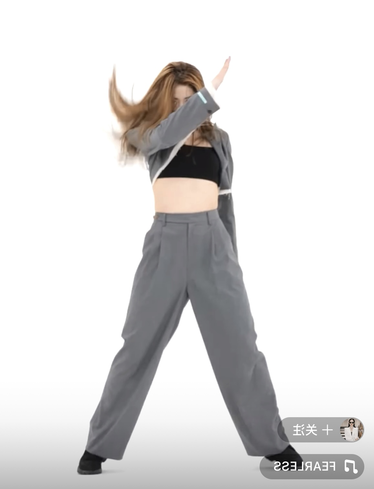

---
author:
- Hao Sun, Joy Xu, Zhecan Yang, Yang Xu

title: "
---

# **K**pop Idol Generator

##  Abstract

In the proposed project, "Kpop Idol Generator," we aim to bridge the gap
between the global K-pop fanbase and their aspiration to emulate
intricate K-pop dance routines despite potential limitations in dance
skills. Utilizing advanced motion capture technologies, our solution
enables users to generate personalized dance videos where they appear to
perform K-pop choreographies with precision. By inputting a professional
dance video and a user’s full-body image, our system utilizes the First
Order Motion Model (FOMM) to synthesize realistic dance performances.
Our approach includes data collection, model training, and iterative
improvements, aiming to enhance the global entertainment experience by
making K-pop more accessible and interactive for fans worldwide.

## Introduction

Korean Pop Music (K-pop), with its global appeal and enthusiastic youth
fanbase, represents a significant cultural phenomenon in the
contemporary entertainment landscape. However, the intricacy of K-pop
dance routines often poses a challenge for fans lacking in dance skills.
Addressing this gap, our project leverages advanced motion capture
technology to enable individuals to quickly perform K-pop dances, thus
offering an immersive experience of being a K-pop star regardless of
their prior dance experience. This initiative not only makes K-pop
culture more accessible but also fosters cultural exchange and
participation, highlighting the potential of technology to enhance
cultural engagement and broaden the impact of global entertainment
phenomena.

## Input and Output

**Input:**

-   **Professional K-pop Dance Video:** Clear, unobstructed video of a
    K-pop dance, featuring simple backgrounds to highlight precise
    movements (Figure 1).

-   **Target Individual’s Picture:** The individual full body picture
    against a clear, simple background, captured in good quality (Figure
    2).

**Output:**

-   **Synthesized Dance Performance:** A video where the target
    individual appears to perform the K-pop dance, showcasing them
    executing the routine with precision (Figure 3).

## Methodology

Our main approach revolves around using the First Order Motion Model.
The task of FOMM is image animation. Given a source image and a driving
video, generate a video in which the protagonist is the source image and
the action is the action in the driving video. The source image usually
contains a subject and the driving video contains a series of action.  
**1. Data collection and processing:** Prepare videos containing human
actions, and perform noise reduction on each frame of the video. In
order to prevent over-fitting of training, a certain degree of data
enhancement can be performed.  
**2. Training:** Using our augmented dataset, we will start running the
FOMM model and observe the results, adjusting the hyperparameters or
dataset to achieve better output.  
**3. Model adjustment:** Based on the results of the initial training,
we will further adjust to improve the model. If the effect fails to meet
expectations, we will replace it with a new model for training. For
example, GAN models such as TransMoMO.  

# Related Work

In exploring digital media, we’ve identified keypoint detection as
crucial for understanding object structure and movement in images,
pinpointing significant positions like corners, edges, or human body
parts. With this foundational understanding, we have discerned that
although Motion Transfer and Image Animation are closely interlinked,
they possess distinct technical attributes and areas of application.

**1 Image Animation**

This field evolved from domain-specific methods like 3D morphable models
for face animation to more versatile techniques. Wang et al. applied
image-to-image translation for motion transfer. Siarohin et al.’s FOMM
model and Monkey-Net framework animate objects without prior
information, using keypoint trajectories, local affine transformations,
and occlusion modeling.

**2 Motion Transformation**

Initially focused on creating content from existing videos, recent
approaches, such as MoCoGAN and Dynamics Transfer GAN, separate motion
from appearance to create new movements in videos. Methods like
TransMoMo achieve motion transfer across varying body shapes and actions
using GANs. This extends to transferring facial expressions and body
poses, with some approaches requiring significant computational
resources.

## Timeline and Milestones

-   **Before 27th February:** Data collection and processing.
    *Deliverable:* A curated and enhanced dataset ready for initial
    training.

-   **28th February - 10th March:** Initial training of FOMM model.
    *Deliverable:* Preliminary performance videos generated by the
    initial FOMM model, along with observations on areas of improvement.

-   **11th March - 22th March:** Model improvement and adjustments based
    on initial results. *Deliverable:* An enhanced FOMM model, optimized
    based on feedback from the initial training, and corresponding
    improved performance videos.

-   **23th March - 5th April:** If time available, and if the effect
    fails to meet expectations, we replace it with a new model.
    *Deliverable:* Training reaults from another model such as
    TransMoMO, with better performance accurancy.

-   **6th April - 11th April:** Final evaluations and result
    consolidation. *Deliverable:* A comprehensive report and
    representation detailing the project’s results, including visual
    examples of generations, insights on model performance, and possible
    future enhancements.

## Evaluation

Evaluating dance video generation is inherently subjective due to its
artistic nature. To objectively measure success, we will:

1.  **Peer Review:** Solicit feedback from fellow students and course
    instructors on the visual appeal of the generated performance video.

2.  **Transformation Consistency:** Evaluate the model’s stability
    across different motion styles, ensuring that the transformations
    maintain a consistent quality.

## Github Repository

[https://github.com/harry-sunhao/kpop-idol-generator](https://github.com/harry-sunhao/kpop-idol-generator/)
